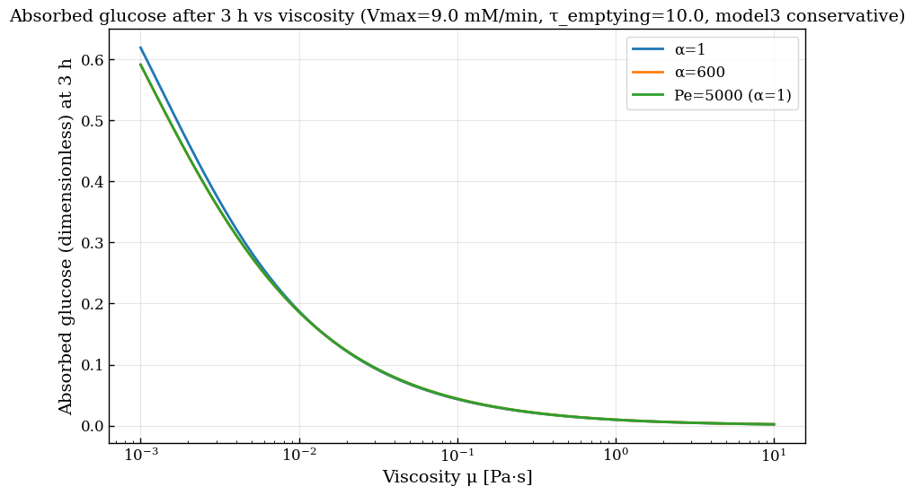

# Intestinal Transport PDE Solver

## Author- Alexander Moller Rivera

A finite-volume BDF solver for a one-dimensional advection–dispersion–reaction model of glucose absorption in the human small intestine.

This project implements and extends the intestinal digestion framework developed by Moxon et al., incorporating axial dispersion via the Taylor–Aris effective dispersion coefficient. The central aim is to investigate how viscosity-dependent transport mechanisms influence glucose absorption dynamics in the small intestine.

---

## Overview

The model couples five physiological and physical processes:

- Gastric emptying
- Axial advection
- Taylor–Aris dispersion
- Michaelis–Menten starch hydrolysis
- Glucose wall absorption

The small intestine is treated as a one-dimensional tubular transport domain. The coupled transport–reaction PDEs are solved using a conservative finite-volume discretization and implicit stiff time integration.

---

## Governing Equations

The solver advances two coupled PDEs: one for starch concentration `S(z, t)` and one for glucose concentration `G(z, t)`.

### Starch balance

```
∂S/∂t = -u ∂S/∂z + D_ax ∂²S/∂z² - V_max·S / (K_m + S) + g·S_s·δ(z - z₀)
```

### Glucose balance

```
∂G/∂t = -u ∂G/∂z + D_ax ∂²G/∂z² + V_max·S / (K_m + S) - (2f / r_m)·K·G
```

**Variables and parameters**

| Symbol    | Description                          |
|-----------|--------------------------------------|
| `S(z, t)` | Starch concentration                 |
| `G(z, t)` | Glucose concentration                |
| `u`       | Mean chyme velocity                  |
| `D_ax`    | Axial dispersion coefficient         |
| `V_max`   | Maximum hydrolysis rate              |
| `K_m`     | Michaelis–Menten half-saturation constant |
| `K`       | Effective wall mass-transfer coefficient |
| `f`       | Absorption factor                    |
| `r_m`     | Intestinal tube radius               |

---

## Axial Dispersion Model

Axial dispersion is modelled using the Taylor–Aris approximation:

```
D_ax = D_m + u²d² / (192 · D_m)
```

The molecular diffusivity `D_m` is determined from the Stokes–Einstein relation:

```
D_m = k_B · T / (6π · μ · r₀)
```

where `k_B` is Boltzmann's constant, `T` is temperature, `μ` is dynamic viscosity, and `r₀` is the solute radius.

This introduces viscosity dependence into both wall mass transfer and longitudinal spreading, allowing investigation of competing transport effects across physiologically relevant viscosity regimes.

---

## Numerical Method

The PDE system is solved using:

- **Conservative finite-volume discretization** — guarantees discrete mass conservation at the algebraic level
- **Upwind differencing** for advection
- **Central differencing** for dispersion
- **Implicit BDF time integration** via `scipy.integrate.solve_ivp` with adaptive stiff time stepping

---

## Repository Structure

```
intestinal-transport-pde/
├── README.md               ← Physics summary, usage, parameter table
├── requirements.txt
├── LICENSE                 ← MIT
├── src/
│   ├── parameters.py       ← All constants from Table 2 of thesis
│   ├── transport.py        ← Stokes–Einstein Dm, Graetz–Lévêque K,
│   │                          Taylor–Aris Dax (Eq. 20), Pe, τ-groups
│   ├── model.py            ← Conservative FV assembly: face fluxes,
│   │                          RHS callable, mass_balance diagnostic
│   ├── solver.py           ← simulate() wrapping scipy BDF
│   └── plotting.py         ← 5 figure functions, used for thesis
├── scripts/
│   └── run_simulation.py   ← Generates all 5 figures (~1–3 min)
├── figures/                ← All 5 PNGs, verified outputs
└── notebooks/
    └── reproduction.ipynb  ← Cell-by-cell walkthrough
```

---

## Installation

Clone the repository:

```bash
git clone https://github.com/YOUR_USERNAME/intestinal-transport-pde.git
cd intestinal-transport-pde
```

Install dependencies:

```bash
pip install -r requirements.txt
```

---

## Running the Solver

```bash
python scripts/run_simulation.py
```

Outputs include:

- Concentration profiles along the intestine
- Total absorbed glucose fraction over time
- Viscosity parameter sweeps
- Plug-flow limit validation

---

## Results

The figure below shows the effect of viscosity on total glucose absorption after 3hrs for various Peclet numbers.



Key observations:

- **Low viscosity** enhances wall mass transfer and increases absorption
- **High viscosity** suppresses mass transfer and reduces glucose uptake
- **Axial dispersion** contributes meaningfully only in low-viscosity regimes; it becomes negligible at high viscosity

---

## Validation

The implementation was validated against several benchmarks:

- **Mass conservation** — conservation error remains below machine-precision integration tolerances throughout all simulations
- **Plug-flow limit** — the solution recovers the plug-flow approximation as Pe → ∞
- **Grid resolution studies** — solution is grid-converged across tested resolutions
- **Numerical diffusion analysis** — upwind scheme diffusion is quantified and bounded

---

## Physical Interpretation

The model confirms that:

- Viscosity is the dominant parameter controlling glucose uptake
- Axial dispersion is a secondary effect, significant only at low viscosity
- Plug-flow approximations remain quantitatively accurate for most physiologically realistic food matrices

---

## References

1. Taylor, G. (1953). Dispersion of soluble matter in solvent flowing slowly through a tube. *Proc. R. Soc. Lond. A.*
2. Aris, R. (1956). On the dispersion of a solute in a fluid flowing through a tube. *Proc. R. Soc. Lond. A.*
3. Moxon et al. Modelling glucose absorption in the human small intestine.
4. SciPy documentation: [`solve_ivp`](https://docs.scipy.org/doc/scipy/reference/generated/scipy.integrate.solve_ivp.html)

---

## Author

**Alexander Møller Rivera**  
BSc Mathematics & Physics — École Polytechnique  
Bachelor Thesis in Mechanics — Imperial College London

Research interests: transport phenomena, numerical PDEs, scientific computing, applied mathematics
